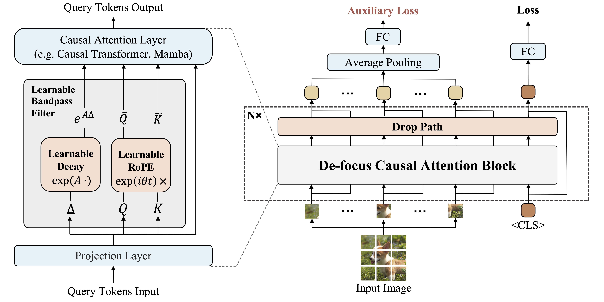

# De-focus Attention Networks
**TL;DR: 1D causal visual modeling can perform competitively with 2D non-causal visual modeling.**

This is the official implementation of the paper [Learning 1D Causal Visual Representation with De-focus Attention Networks](https://arxiv.org/abs/2406.04342).




## 🏠 Introduction

De-focus Attention Networks are causal models equipped with de-focus mechanisms, enabling 1D causal visual representation learning. 

We first identify an "over-focus" issue observed in causal vision models:

- In causal vision models, they overly focus on a small proportion of visual tokens in the deeper layers of the network, during both forward and backward.

To address this issue, De-focus Attention Networks integrate learnable bandpass filters into the existing attention operators to achieve diverse attention patterns. In addition, a large drop path probability and an auxiliary loss on average pooled features are also introduced during training to enhance network optimization.

De-focus Attention Networks have the following characteristics:

- Compared with causal methods (e.g., causal ViT, Mamba), De-focus Attention Networks have more evenly distributed attention and better backward gradient.

- Compared with non-causal methods, De-focus Attention Networks achieve comparable or even better performance in tasks requiring global perception, dense prediction and multi-modal understanding tasks. 


## 📈 Main Results

### Classification on ImageNet-1K

| method | causal | pretrain | resolution |acc@1 | #params | download |
| :---: | :---: | :---: | :---: | :---: | :---: | :---: |
| DeiT-Small | False | None | 224x224 | 79.9 | 22.1M | -- |
| Mamba-ND-Small | False | None | 224x224 | 79.4 | 24M | -- |
| Vision Mamba-Small | False | None | 224x224 | 80.5 | 26M | -- |
| Vision RWKV-Small | False | None | 224x224 | 80.1 | 23.8M | -- |
| DeiT-Small | True | None | 224x224 | 78.6 | 22.1M | -- |
| Mamba-Small | True | None | 224x224 | 78.7 | 24.7M | -- |
| Mamba-ND-Small | True | None | 224x224 | 76.4 | 24M | -- |
| **De-focus Mamba-Small** | True | None | 224x224 | 80.3 | 25.1M | -- |

| method | causal | pretrain | resolution |acc@1 | #params | download |
| :---: | :---: | :---: | :---: | :---: | :---: | :---: |
| DeiT-Base | False | None | 224x224 | 81.8 | 86.6M | -- |
| S4ND-ViT-B | False | None | 224x224 | 80.4 | 88.8M | -- |
| Vision RWKV-Base | False | None | 224x224 | 82.0 | 93.7M | -- |
| **De-focus ViT-Base** | False | None | 224x224 | 81.8 | 87.4M | -- |
| DeiT-Base | True | None | 224x224 | 80.1 | 86.6M | -- |
| RetNet-Base | True | None | 224x224 | 79.0 | 93.6M | -- |
| Mamba-Base | True | None | 224x224 | 80.5 | 91.9M | -- |
| **De-focus ViT-Base** | True | None | 224x224 | 81.5 | 87.4M | -- |
| **De-focus RetNet-Base** | True | None | 224x224 | 81.7 | 92.7M | -- |
| **De-focus Mamba-Base** | True | None | 224x224 | 82.0 | 92.7M | [cfg](classification/configs/defocus_mamba_base.yaml) \| [ckpt](https://github.com/OpenGVLab/De-focus-Attention-Networks/releases/download/v1.0/defocus_mamba_base_cls.pth) |

| method | causal | pretrain | resolution |acc@1 | #params | download |
| :---: | :---: | :---: | :---: | :---: | :---: | :---: |
| ViT-Large | False | ImageNet-21K | 384x384 | 85.2 | 309.5M | -- |
| Vision RWKV-Large | False | ImageNet-21K | 384x384 | 86.0 | 334.9M | -- |
| **De-focus Mamba-Large** | True | ImageNet-21K | 384x384 | 85.9 | 330.1M | [cfg](classification/configs/defocus_mamba_large.yaml) \| [21K ckpt](https://github.com/OpenGVLab/De-focus-Attention-Networks/releases/download/v1.0/defocus_mamba_large_cls_21k.pth) \| [ckpt](https://github.com/OpenGVLab/De-focus-Attention-Networks/releases/download/v1.0/defocus_mamba_large_cls_1k.pth) |

Different types of De-focus Attention Networks at various scales are evaluated, with comparisons to both causal and non-causal models. 

Note:

(1) Previous causal models have significantly inferior performance to non-causal models.

(2) Our models significantly outperform other 1D causal models and achieve comparable performance to 2D non-causal models.

(3) Our models work well across various networks, e.g., Causal ViT, Mamba, and RetNet. 

(4) Our models remain on par with the 2D non-causal ViTs, as the model size increases from small to large.

### Object Detection on COCO

| method | causal | pretrain | epochs | box mAP | box AP50 | box AP75 | #params | download |
| :---: | :---: | :---: | :---: | :---: | :---: | :---: | :---: | :---: |
| ResNet-50 | False | ImageNet-1K | 12 | 49.0 | 66.6 | 53.5 | 47M | -- |
| DeiT-Base | False | ImageNet-1K | 12 | 49.1 | 69.9 | 52.7 | 110M | -- |
| **De-focus Mamba-Base** | True | ImageNet-1K | 12 | 50.2 | 68.2 | 54.5 | 115M | [cfg](detection/configs/dino/defocus_mamba_base_12ep.py) \| [ckpt](https://github.com/OpenGVLab/De-focus-Attention-Networks/releases/download/v1.0/defocus_mamba_base_det_12ep.pth) |
| ResNet-50 | False | ImageNet-1K | 36 | 50.9 | 69.0 | 55.3 | 47M | -- |
| DeiT-Base | False | ImageNet-1K | 36 | 52.3 | 72.5 | 56.7 | 110M | -- |
| **De-focus Mamba-Base** | True | ImageNet-1K | 36 | 53.2 | 71.5 | 58.0 | 115M | [cfg](detection/configs/dino/defocus_mamba_base_36ep.py) \| [ckpt](https://github.com/OpenGVLab/De-focus-Attention-Networks/releases/download/v1.0/defocus_mamba_base_det_36ep.pth) |

Note:

(1) De-focus Mamba remarkably outperforms non-causal models such as DeiT and ResNet-50. 

(2) This trend of superior performance persists even with an increasing number of training epochs. 

(3) Excellent performance on the APbox75 metric may suggest that De-focus Attention Networks are more effective at fine-grained localization.


## 🛠️ Usage
Please refer to [classification](./classification/README.md) and [detection](./detection/README.md) for details.

## 📃 License

This project is released under the [MIT license](./LICENSE). Parts of this project contain code and models from other sources, which are subject to their respective licenses.

## 🖊️ Citing De-focus Attention Networks
If you find De-focus Attention Networks useful in your research, please consider citing:
```bibtex
@article{tao2024learning,
  title={Learning 1D Causal Visual Representation with De-focus Attention Networks},
  author={Tao, Chenxin and Zhu, Xizhou and Su, Shiqian and Lu, Lewei and Tian, Changyao and Luo, Xuan and Huang, Gao and Li, Hongsheng and Qiao, Yu and Zhou, Jie and Dai, Jifeng},
  journal={arXiv preprint arXiv:2406.04342},
  year={2024}
}
```
